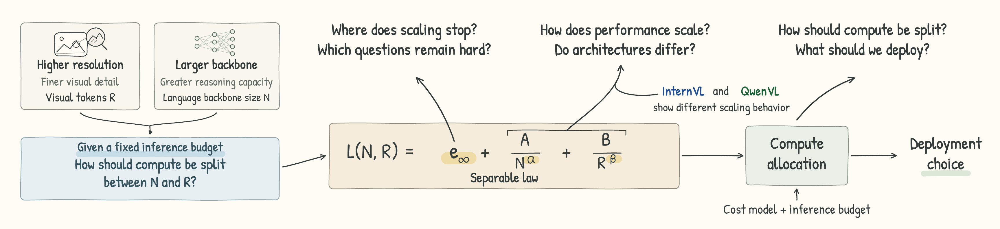

# Not All Error Yields to Scale: Where Scaling Stops in Vision-Language Inference

**Xinye Zhao · Yunkai Dang · Yunchen Wu · Wenbin Li**

School of Intelligence Science and Technology, Nanjing University

[Paper](https://arxiv.org/pdf/2610.01640) · [arXiv](https://arxiv.org/abs/2610.01640)



## Abstract

Vision-language models (VLMs) face a fixed-budget trade-off between processing more visual information for fine-grained perception and using a larger language backbone for complex reasoning. Existing studies do not tell us which combination of backbone size and input resolution to deploy, especially in high-resolution deployments. To address this gap, we propose the Separable Law that describes how VLM performance changes with language backbone size and visual token count. We fit the law to measurements from 26 InternVL and QwenVL models, with language backbone sizes from 1B to 72B, on four high-resolution benchmarks with image sizes from 224 pixels to 8K. We find that the questions responding to scaling can be predicted from the skill they require, while a substantial fraction never responds at all. We also find that the two model families gain similarly from a larger backbone, while their gains from more visual tokens differ sharply. Combined with a cost law, the Separable Law gives a closed-form rule for allocating compute between backbone size and visual tokens. When deployment is limited to available configurations, the law identifies model and image sizes that perform close to the best feasible choice under the same budget. We hope our work offers a principled way to decide how much a model should be allowed to see at high resolution, given what it must reason about.

## Key Findings

1. **Scaling leaves persistent errors.** Scaling helps most questions but not all. Required skill explains more variation in the fitted error floor than visual domain.

2. **Visual-token scaling depends on architecture.** The two families agree on capacity but differ sharply on visual tokens. Their frontends turn the same pixel budget into very different token counts.

3. **The law guides compute allocation.** Combined with a cost law, the Separable Law directs extra compute toward a larger backbone for InternVL and more visual tokens for QwenVL. It selects configurations close to the best feasible choice under the same budget.

## Citation

```bibtex
@misc{zhao2026erroryieldsscalescaling,
      title={Not All Error Yields to Scale: Where Scaling Stops in Vision-Language Inference},
      author={Xinye Zhao and Yunkai Dang and Yunchen Wu and Wenbin Li},
      year={2026},
      eprint={2610.01640},
      archivePrefix={arXiv},
      primaryClass={cs.CV},
      url={https://arxiv.org/abs/2610.01640},
}
```

## Code

**Code will be released soon.**
